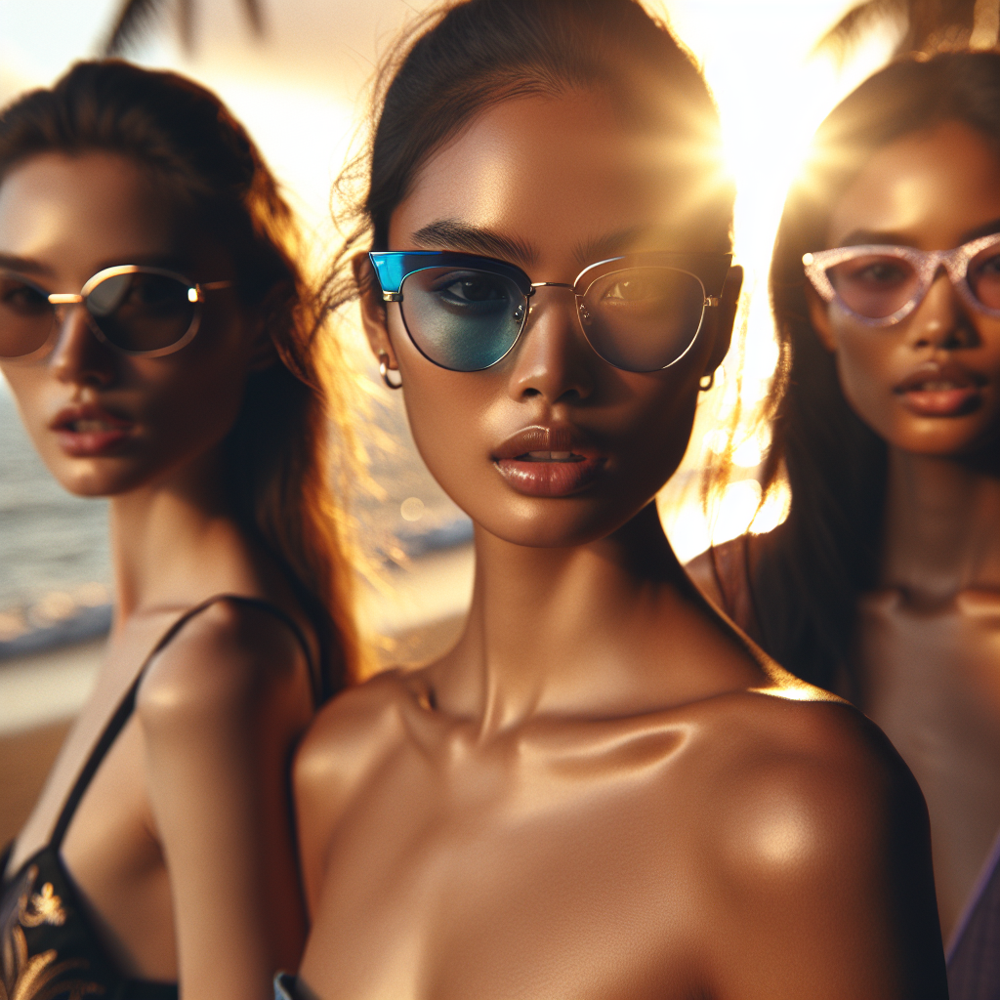

# 🕶️ Summer Sunglasses Campaign – Executive Summary

## 📊 Refined Trend Insights
Executive Summary  
For Summer 2026, eyewear is defined by three clear style pillars—maximal statements, refined metalwork, and polished retro silhouettes. Our curated selection of Aviator (SG001), Mystique (SG003) and Wayfarer (SG002) models delivers a cohesive, on-trend portfolio that aligns with consumer demand and supports a dynamic, mix-and-match campaign.

Key Trends  
1. Oversized Statement Frames  
   • Butterfly-inspired curves and bold square/mask shapes command attention with high-fashion energy.  
2. Thin Metal & Wireframe Styles  
   • Lightweight aviators and minimalist wireframes lend modern polish, versatility and all-day comfort.  
3. Retro Revival (Cat-Eye, Square & Oval)  
   • Iconic ’50s-’70s profiles—reimagined cat-eyes, crisp squares and soft ovals—dominate both street style and runway.

Strategic Product Selection  
1. Aviator (SG001)  
   • Pure metal frame with generous teardrop lenses—ideal for customers seeking sleek, lightweight summer eyewear.  
2. Mystique (SG003)  
   • Contemporary cat-eye with subtle temple detailing—captures the retro-revival trend in a distinctly feminine silhouette.  
3. Wayfarer (SG002)  
   • Thick acetate and angular lines—delivers the oversized-statement impact while nodding to classic retro styling.

Campaign Rationale  
• Comprehensive Trend Coverage: Each model embodies one of the three core pillars—statement, minimalist metal, retro—enabling versatile cross-selling.  
• Stock Assurance: All selected frames are readily available for immediate launch.  
• Broad Market Appeal: From sport-luxe to high-fashion editorial, our assortment speaks to diverse segments and drives summer sales.

## 🎯 Campaign Visual

    

## ✍️ Campaign Quote
Chase the golden hour in bold, retro-chic summer shades

## ✅ Why This Works
The phrase evokes the beach sunset scene and highlights oversized statement and cat-eye silhouettes—perfectly capturing the summer ’26 trends of bold impact and retro revival.

---

*Report generated on 2026-03-26*
